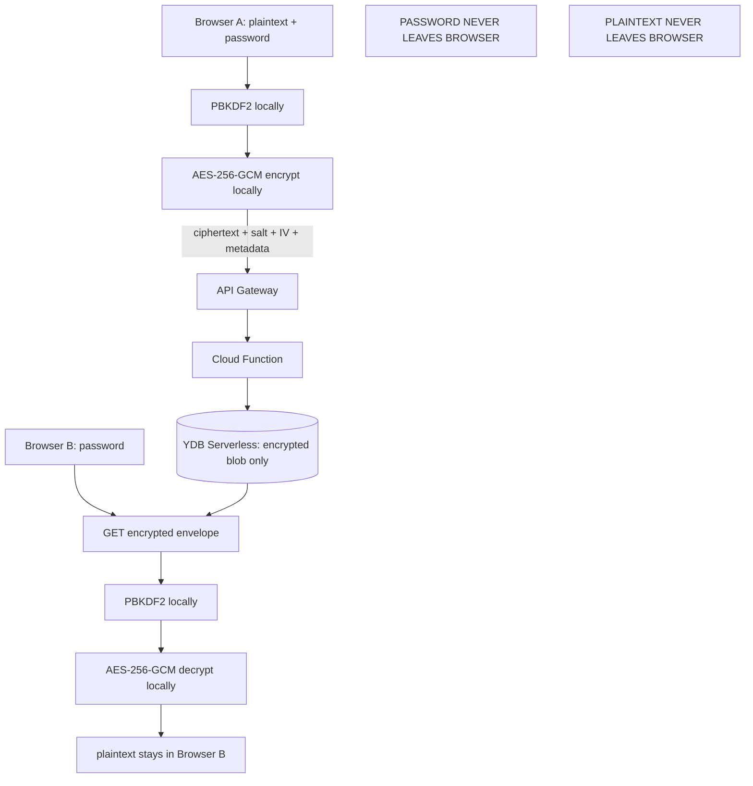

# CryptPaste — архитектура

## Решение в двух словах

CryptPaste — статический браузерный интерфейс для передачи небольших заметок.
Текст и пароль обрабатываются только в браузере. На backend попадает envelope с
зашифрованным payload и техническими метаданными; backend не получает
plaintext, пароль или ключ.

## Исследование и выбранный стек

- **Шифрование:** Web Crypto API, AES-256-GCM, случайный 96-bit IV и 128-bit
  salt из `crypto.getRandomValues()`.
- **KDF:** PBKDF2-HMAC-SHA-256, 600 000 итераций. Web Crypto API поддерживает
  PBKDF2 и AES-GCM во всех целевых браузерах. Argon2id не входит в Web Crypto
  API; WASM-пакет увеличил бы bundle, поверхность supply-chain и стоимость
  холодной загрузки. Для коротких заметок выбран переносимый стандартный
  вариант, а слабые пароли отдельно отражены в threat model.
- **Frontend:** TypeScript без UI-фреймворка, Vite только для dev/build.
  Runtime bundle состоит из собственного JS и Web Crypto API; CDN и tracking
  не используются. Build создаёт `frontend/dist` с относительными asset paths,
  подходящими для GitVerse Pages.
- **Backend:** Node.js 22 Cloud Function (локальная разработка совместима с
  Node.js 20.19+). Общий HTTP-router запускается и в
  локальном dev adapter, и в Yandex Cloud Function.
- **Storage:** YDB Serverless, одна таблица `pastes` с primary key по случайному
  96-bit URL-safe ID. YDB JavaScript SDK (`@ydbjs/core`, `@ydbjs/query`) позволяет
  использовать параметризованные YQL-запросы.
- **Gateway:** Yandex API Gateway, OpenAPI 3, Cloud Functions integration,
  точный CORS allowlist и gateway rate limit. Максимальный plaintext frontend и
  backend — 32 KiB; итоговый JSON envelope ограничен 64 KiB, хотя API Gateway
  допускает существенно больше.
- **Hosting:** production frontend — GitVerse Pages. GitHub — публичное
  зеркало исходников; GitHub Pages не используется.

## Поток данных



## Versioned envelope

```json
{
  "v": 1,
  "alg": "AES-256-GCM",
  "kdf": "PBKDF2-SHA256",
  "iterations": 600000,
  "salt": "base64url",
  "iv": "base64url",
  "ciphertext": "base64url",
  "size": 123
}
```

`size` — число байт исходного UTF-8 текста. Оно нужно для независимой
проверки лимита, но не является секретом. Пароль не проверяется отдельным
hash: неправильный пароль приводит к AES-GCM authentication failure.

## Удаление

При создании браузер генерирует отдельный случайный author delete token.
Backend хранит только SHA-256 этого токена; сам токен остаётся в памяти
страницы результата. Он не входит в публичную ссылку.

Для `delete-after-read` GET выдаёт отдельный одноразовый read-delete token.
После успешной локальной расшифровки браузер отправляет его в DELETE. Это
best effort: две вкладки могут получить ciphertext до удаления, и обе смогут
успешно расшифровать его. Поэтому функция не обещает математически
одноразовый доступ.

TTL проверяется при GET и DELETE, а истёкшие записи удаляются лениво при
обращении. Это даёт корректное пользовательское поведение без отдельного
платного scheduler; для роста нагрузки можно добавить YDB TTL/плановую
очистку.

## Ограничения и trust model

Сервис защищает stored encrypted blobs от чтения оператором базы/backend и от
случайного просмотра payload. Он не защищает слабый пароль, keylogger,
вредоносное расширение, XSS или компрометированный deployment frontend.
Администратор, способный заменить опубликованный JavaScript, может украсть
пароль при следующем использовании; поэтому это не абсолютная гарантия
неподконтрольности владельцу сайта.

## Deployment

Инфраструктурные файлы в `infra/` и скрипты в `scripts/` создают/обновляют
YDB, Cloud Function и API Gateway через уже установленный Yandex Cloud CLI.
Перед применением скрипты требуют явных параметров/переменных и не печатают
секреты. `docs/release-history.md` фиксирует non-secret результат релиза.
