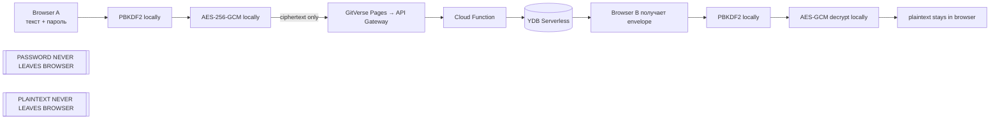
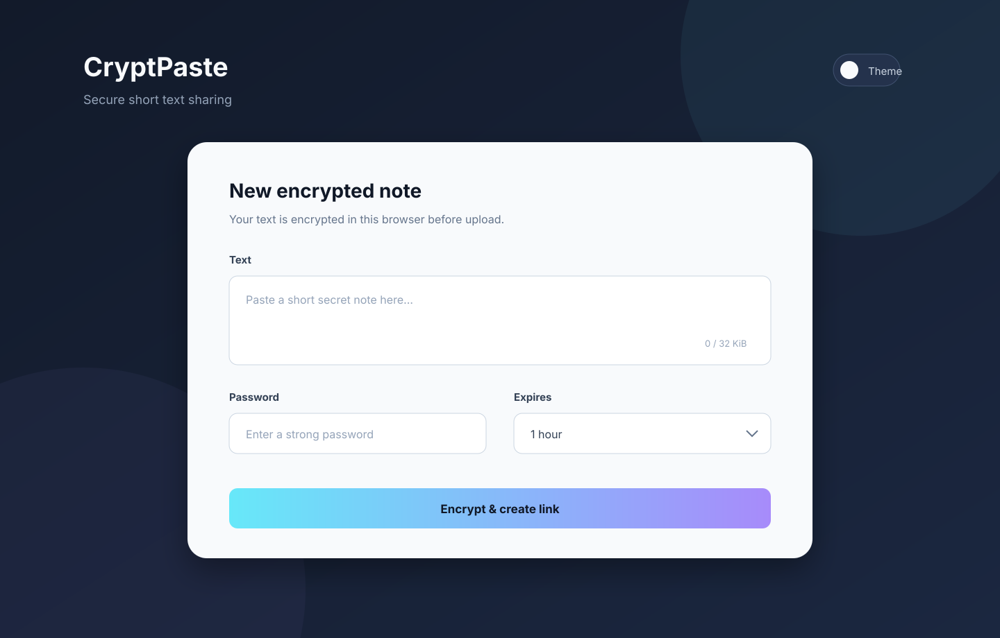

# CryptPaste

CryptPaste — небольшой open-source сервис для безопасной передачи коротких
текстовых заметок между компьютерами.

Главное свойство: текст шифруется в браузере до отправки. Сервер хранит только
зашифрованный envelope и технические метаданные. Пароль, plaintext и ключ
шифрования на backend не отправляются.

## Архитектура



Выбранный crypto stack: стандартный Web Crypto API, AES-256-GCM, случайные
salt/IV через `crypto.getRandomValues()`, PBKDF2-HMAC-SHA-256 с 600 000
итерациями. Неправильный пароль определяется только неудачей AES-GCM
аутентификации; hash пароля на сервер не отправляется.



## Быстрый старт

Требуется Node.js 20.19+.

```bash
npm install
npm run dev
```

Откройте `http://localhost:5173`. Локальный API adapter хранит данные в
памяти процесса и повторяет production API. Проверки и production build:

```bash
npm run check
```

## API

- `GET /health` — health check.
- `POST /pastes` (локально через `/api/pastes`) — принимает только encrypted envelope, TTL и hashable
  delete token; plaintext и пароль в контракте отсутствуют.
- `GET /pastes/{id}` — возвращает encrypted envelope.
- `DELETE /pastes/{id}` — удаляет по owner delete token или по
  server-issued read-delete token.

Публичный ID — 16 URL-safe символов, полученных из 96 случайных бит. Лимит
исходного UTF-8 текста — 32 KiB. TTL: 10 минут, 1 час, 24 часа или 7 дней.

## Локальная структура

```text
frontend/             vanilla TypeScript UI + Vite build
backend/              общий router, dev adapter, YDB adapter, tests
infra/                YDB schema и API Gateway OpenAPI template
scripts/              dev orchestration
ARCHITECTURE.md       архитектурные решения и trust model
THREAT_MODEL.md       угрозы и границы защиты
SECURITY.md           security policy
PRIVACY.md            короткая privacy notice
```

## Deployment

Production frontend размещается только через GitVerse Pages. GitHub — публичное
зеркало исходников и не используется для GitHub Pages.

Yandex Cloud topology: GitVerse Pages → Yandex API Gateway → Yandex Cloud
Functions → YDB Serverless. Deployment helper использует авторизованный `yc`
CLI, не кладёт токены в Git и не печатает request body. Перед применением
проверьте переменные из `.env.example`, затем:

```bash
npm run check
./scripts/deploy-yandex.sh
```

Скрипт намеренно требует явные имена ресурсов и не удаляет существующие
ресурсы. Настройка GitVerse Pages выполняется в Settings → Pages; repo должен
быть публичным, source — Workflow, если используется `.gitverse/workflows`.

## Ограничения

- Сервис предназначен для коротких заметок, а не для постоянного хранилища.
- Слабый пароль можно перебрать offline после утечки ciphertext.
- `delete-after-read` — best effort: две вкладки, получившие ciphertext до
  удаления, обе могут расшифровать заметку.
- Компрометация будущего JavaScript на GitVerse Pages может украсть пароль при
  вводе. См. [THREAT_MODEL.md](THREAT_MODEL.md).
- Clipboard history, скриншоты, keylogger и вредоносные расширения браузера
  находятся вне контроля сервиса.

## Лицензия

[MIT](LICENSE)
